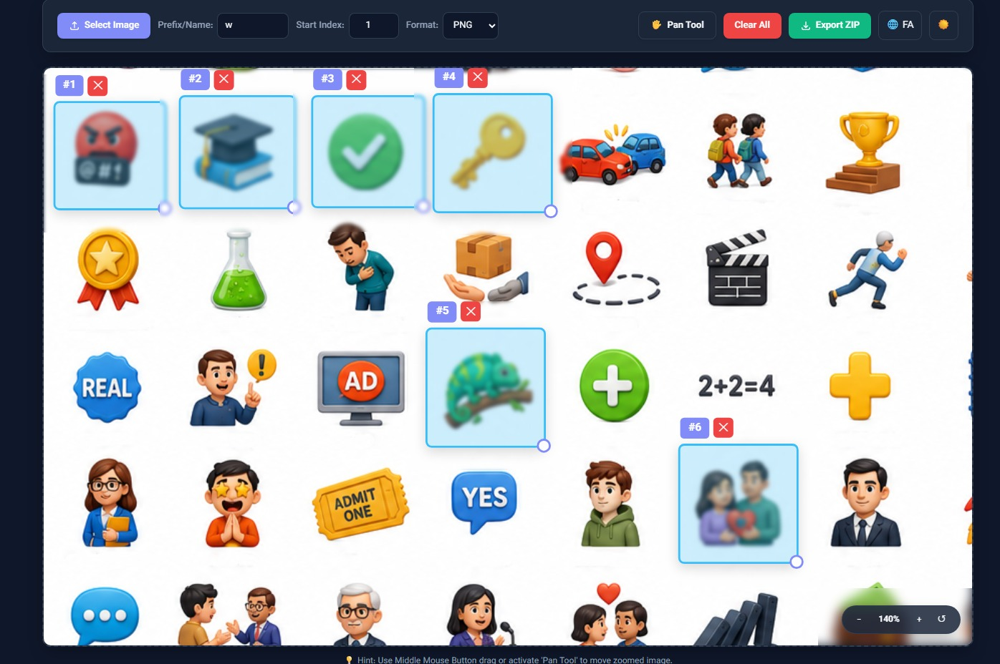

# ✂️ Web Image Splitter

> A modern, browser-based web application to instantly split, crop, and slice images into custom grids or specific pixel dimensions — with zero server uploads required!

---

## 📸 Screenshots

  

---

# 🎨 Image Splitter

> **A powerful, client-side web application for splitting pixel art, sprite sheets, and asset packs with ease.**

---

## 🌟 Key Features

### ✂️ Precision Crop & Grid Tools
* **Manual Drag-and-Drop Crop:** Click and drag anywhere on the canvas to define custom selection boxes.
* **Custom Dimension Panel:** Set exact width and height ($W \times H$) for selected boxes or default new ones.
* **Batch Grid Split:** Automatically generate a uniform grid ($Columns \times Rows$) across the entire canvas with a single click.
* **Interactive Guide Lines:** Place horizontal and vertical split lines on your image and instantly divide it into separate assets.

### 🧠 Smart Asset Auto-Detection
* **Intelligent Edge & Blob Detection:** Automatically scans your asset sheet, detects individual sprites, and wraps them in crop boxes.
* **Adjustable Sensitivity Slider:** Fine-tune the detection algorithm for dense, transparent, or low-contrast sprite sheets.

### ↩️ Full Undo & Redo History
* **State Management:** Fully tracked history system for box creation, moving, resizing, and guide lines.
* **Dedicated Controls:**
  * **UI Buttons:** Dedicated Undo (`↩️`) and Redo (`↪️`) toolbar buttons.
  * **Keyboard Shortcuts:** `Ctrl + Z` for Undo and `Ctrl + Y` (or `Ctrl + Shift + Z`) for Redo.

### 👾 Pixel-Perfect Rendering
* **Crisp Sprite Display:** Toggle Pixel-Perfect mode to keep retro pixel art sharp and clear without blurry interpolation.

### 📱 Touch & Multi-Device Support
* **Pointer Events Integration:** Smooth interaction across Desktop, Laptops, Mobile Devices, Tablets, and Stylus/Pens (`pointerdown`, `pointermove`, `pointerup`).

### 📦 Flexible Export Options
* **Individual File Downloads:** Preview cropped sections in a modal and download specific assets individually.
* **Bulk ZIP Export:** Batch export all cropped sections into a single ZIP file with custom sequential naming (e.g., `asset0001.png`, `asset0002.png`).
* **Format Support:** Export directly to **PNG**, **JPEG**, or **WEBP**.
* **Offline ZIP Engine Engine:** Includes a lightweight, standalone JS ZIP fallback algorithm—works $100\%$ offline without requiring internet or external dependencies.

### 🌐 Universal & Accessible UX
* **Multilingual UI:** Toggle instantly between **Persian (RTL)** and **English (LTR)**.
* **Dark / Light Theme:** Seamless switchable Dark and Light visual themes with setting persistence.
* **Auto-Save Preferences:** Settings like prefix name, image format, pixel mode, and sensitivity are automatically remembered in `localStorage`.

---

## ⌨️ Hotkeys & Shortcuts

| Action | Shortcut |
| :--- | :--- |
| **Undo** | `Ctrl + Z` |
| **Redo** | `Ctrl + Y` or `Ctrl + Shift + Z` |
| **Delete Selected Box** | `Delete` or `Backspace` |
| **Pan Canvas** | Hold `Spacebar` + Drag Left Click |
| **Zoom In / Out** | `Mouse Wheel` or UI Controls (`+` / `-`) |

---

## 🛠️ Built With

* **HTML5 Canvas & Vanilla JavaScript** (Zero heavy framework overhead)
* **CSS Custom Properties** (For dynamic RTL/LTR and Dark/Light styling)
* **JSZip API** (With an integrated offline fallback generator)

---

## 🚀 Quick Start

1. Download or clone the `index.html` file.
2. Open `index.html` in any modern web browser (Chrome, Firefox, Edge, Safari).
3. Drag & Drop your sprite sheet or click **Select Image** to get started!

---

Made for pixel artists, game developers, and designers. 🚀

## ❤️☕ Support / Donation

If you find this project useful, you can support its development:

- **Monero (XMR)** *(Preferred for privacy)*:
8B7ukqcbMLdhDzLvUFVjQu3oHhK6SFAvtJt7BtvuqdcsFXicSBxQkSLdCzDaK7gRibUQHnXy3z2r5c3CSkghvckc1zbueVg

- **Bitcoin (BTC)**:
bc1qd4vs6srrc52mfwqvhhdr9yfpycxkn0362cg7w3

- **Ethereum (ETH) / USDT (ERC-20 / BEP-20)**:
0x9f55C92B05D7097443F0bADeF1BD3D6c657F9506

- **GRAM Toncoin (GRAM)**:
UQA3MKJZQc4XFQtUrFGkr0hTA0VMedbYDj6a4jyDp71dEwxr
